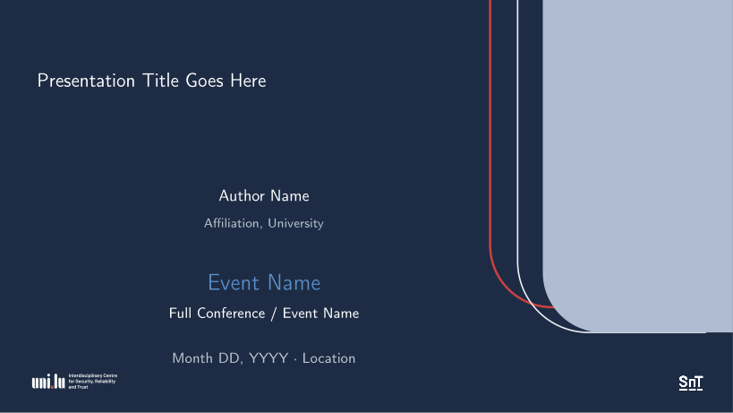
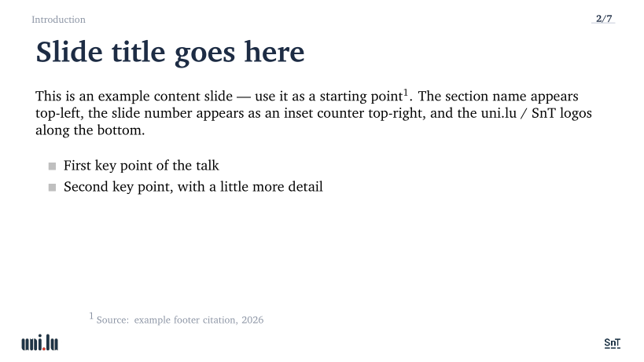

# UniLU/SnT Beamer Theme

A clean, minimal Beamer theme for academic presentations, extended from
[mvsoom/beamerthemeblei](https://github.com/mvsoom/beamerthemeblei) with a full
University of Luxembourg / SnT institutional identity.

Preview of the title, section-card, and content layouts:

| Title | Section card | Content |
|---|---|---|
|  |  |  |

Build locally (see [Quick start](#quick-start)) to produce the full `example.pdf`.
The compiled PDF is a build artifact and is intentionally not tracked in Git;
regenerate `preview/*.png` from a fresh build if you change the design.

## Features

- Navy title slide and mirrored contact/closing slide with TikZ geometry
- Automatic per-section "Contents" dividers with clickable navigation
- Bottom-centre outline button on every content slide (jumps to current section)
- Numbered corner arc (frame counter) on content slides
- uni.lu + SnT footer logos on content and divider slides
- `\notes{point; point}` helper for structured speaker notes
- `\widesep` for relaxed bullet spacing
- `\colorboxed` for highlighting equations
- `\missingfigure{}` placeholder — missing figure paths compile cleanly
- Built-in bibliography support with `biblatex` / `biber`

## Quick start

1. Clone the repo. Building from the repo root works as-is — `pdflatex` finds
   `beamerthemeblei.sty` in the working directory. (Optional: to use the theme
   from *any* directory, copy it into your local texmf tree at
   `~/texmf/tex/latex/local/beamerthemeblei.sty`. This is not required for the
   standard root build.)
2. Edit `Sections/01_metadata.tex` — set your title, author, event, and contact details.
3. Replace `Sections/03_*.tex` through `Sections/08_*.tex` with your content.
4. Build:
   ```powershell
   # Windows PowerShell 5.1 (what ships with Windows):
   powershell -ExecutionPolicy Bypass -File academic-beamer/scripts/build.ps1
   # or, if PowerShell 7 is installed:
   pwsh academic-beamer/scripts/build.ps1
   ```
   Two passes are mandatory (TikZ `remember picture`). The script closes Adobe
   Acrobat before compiling to avoid PDF file-lock errors, deletes the previous
   PDF so a failed build cannot leave a stale one behind, and reports failure on
   a non-zero `pdflatex` exit.

## File map

```
UniLU_PPT/
  example.tex              driver — \input order, \begin/\end{document}
  beamerthemeblei.sty      base theme (do not edit unless redesigning)
  library.bib              BibLaTeX bibliography
  Assets/                  logos and QR assets
  Sections/
    00_preamble.tex        packages, macros, content-slide chrome
    01_metadata.tex        ← edit per talk: title, author, event, colours
    02_title_slide.tex     navy title slide (TikZ) — preserve unless redesigning
    03_motivation_and_model.tex
    04_prior_candidates.tex
    05_derivation_and_properties.tex
    06_application.tex
    07_summary.tex
    08_references.tex      replace 03–08 with your content
    09_closing.tex         closing/contact slide — preserve unless redesigning
  academic-beamer/
    SKILL.md               AI agent briefing for this template
    content_guidelines.md  argument structure and slide density rules
    slide_patterns.md      copy-paste LaTeX frame templates
    prompts/               ready-made agent prompts
    scripts/
      build.ps1            two-pass build + PDF-lock workaround
      clean_bg.py          flood-fill background remover for logos (Pillow)
```

## Decision table

| Want to change | Edit |
|---|---|
| Title, author, date, event, contact, theme colours | `Sections/01_metadata.tex` |
| Content-slide chrome: section label, corner arc, footer logos | `Sections/00_preamble.tex` |
| Title slide (panel, arcs, logos) | `Sections/02_title_slide.tex` |
| Closing/contact slide or QR card | `Sections/09_closing.tex` |
| Add or reorder slides | Create `Sections/NN_name.tex`, add `\input{...}` to `example.tex` |
| Packages or shared macros | `Sections/00_preamble.tex` |

## Slide patterns

See `academic-beamer/slide_patterns.md` for ready-to-copy templates:
standard claim, two-column, equation, overlay, figure-result, summary, backup.

## Assets

Logo files sit in `Assets/`. Files ending `_clean.png` have a transparent
background suitable for navy slides; regenerate them with `clean_bg.py` if you
replace a source logo.

## Credits

Base theme by [mvsoom](https://github.com/mvsoom/beamerthemeblei), inspired by
David Blei's Variational Inference tutorial slides. Extended with UniLU/SnT
institutional identity by Shehbaz Tariq.

Released under the MIT license.
